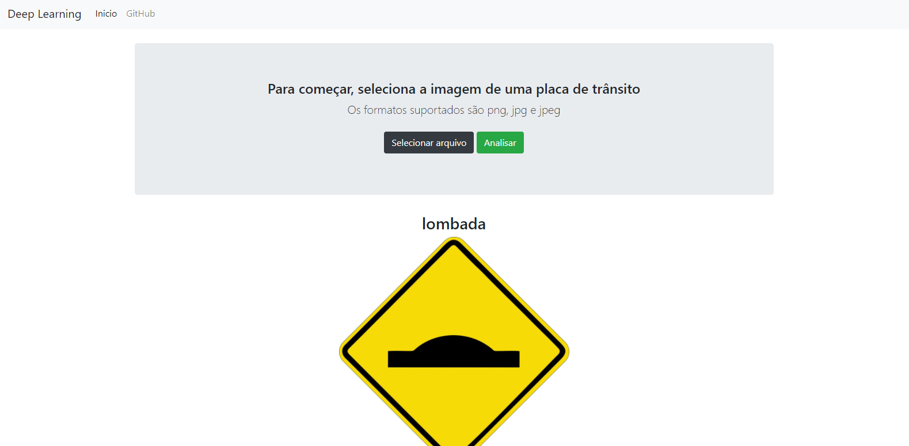

# DeepLearning Traffic Signs 

|Aluno|Matrícula|
|:--:|:--:|
|Marcos Nery Borges Júnior|170017885|

## Sobre
Este projeto constitui uma aplicação que utiliza uma rede neural convolucional para reconhecer placas de trânsito. Dessa forma, é possível fazer o upload da imagem de uma placa e visualizar o resultado do reconhecimento.

## Instalação 
**Linguagem**: Python >= 3.8  
**Framework**: Flask   

O projeto está disposto em duas formas diferentes. Uma é pelo Jupyter notebook, que tem todo o código completo etapa por etapa. Para executar/visualizar o notebook basta instalar o jupyter notebook na sua maquina através das instruções dispostas na seção "Getting started with the classic Jupyter Notebook" [aqui](https://jupyter.org/install). [Você também pode executar o jupyter notebook através do navegador](https://mybinder.org/v2/gh/ipython/ipython-in-depth/master?filepath=binder/Index.ipynb) (não recomendado) ou utilizar o docker, seguindo as instruções mais abaixo.

A outra frente do projeto é um frontend, pelo qual você também pode utilizar a aplicação, trocando a didática do jupyter pelo conforto de ter um design. Para executar essa frente, caso não tenha docker, basta instalar o micro-framework [Flask](https://flask.palletsprojects.com/en/1.1.x/installation/) e em seguida executar o seguinte comando:

`pip install -r requirements.txt && python web/app.py`

## Instalação com Docker

Se você tiver docker na sua máquina tudo fica mais fácil. Basta executar o comando `docker-compose up` e dois ambientes estarão em funcionamento.
  
  * Para acessar o jupyter notebook basta ir até http://localhost:8888/ (o token de autenticação é exposto no terminal ao rodar o compose-up)
  * Para acessar o frontend basta ir até http://localhost:5000/

## Screenshots

